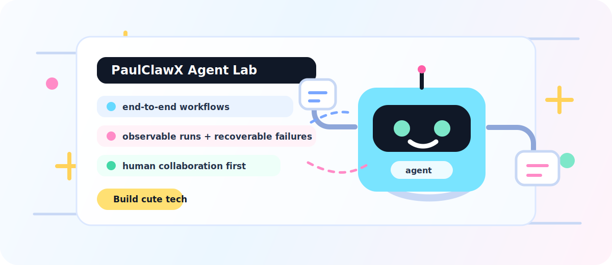
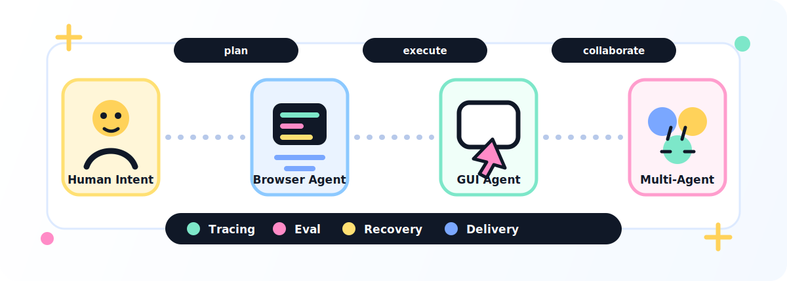

# PaulClawX

  

  <a href="https://github.com/paulpanwang">联系主页</a> ·
  <a href="mailto:pualpanwang@gmail.com">pualpanwang@gmail.com</a>

  
  
  
  

## 我们在做什么

PaulClawX 关注真实世界里的智能体工作流：让 AI 不只是完成演示，而是能在浏览器、桌面、面试训练、多智能体协作等场景里稳定执行任务。

我们的方向很清楚：**把智能体从“会操作”推进到“可靠地交付”**。这意味着每一次执行都应该可观察、可恢复、可协作，也能在失败时留下清楚的状态和下一步。

## 项目愿景

  

| 愿景模块 | 我们希望它变成什么 |
| --- | --- |
| Human + Agent | 智能体在人的工作流旁边协作，而不是粗暴接管环境。 |
| Browser Agent | 面向网页任务的自动化执行，强调可重复、可追踪、可恢复。 |
| GUI / Computer Use | 让智能体理解和操作真实桌面环境，减少重复手动操作。 |
| Interview Agent | 用结构化反馈、rubric 和评估闭环，帮助训练与复盘。 |
| Multi-Agent Workflows | 让多个角色拆分任务、并行推进、汇总结果。 |
| Tracing & Eval | 记录真实执行过程、失败原因和改进信号，而不是只看漂亮 demo。 |

## 正在探索的项目

### [`browser-agent`](https://github.com/PaulClawX/browser-agent)

> Never send a human to do a machine's job.

- 浏览器自动化与工具调用，用于完成真实网页任务
- 关注重复执行、过程追踪、失败恢复和任务交付质量
- 适合沉淀从“点击页面”到“完成流程”的智能体基础设施

### [`interview-agent`](https://github.com/PaulClawX/interview-agent)

> Turn practice into structured feedback loops.

- 面试练习、反馈、rubric 和 prompt 迭代
- 用可评估的流程帮助复盘，而不是只给泛泛建议
- 探索智能体在训练、评审和长期成长场景中的协作方式

### [`PaulClawX/.github`](https://github.com/PaulClawX/.github)

- 组织主页与社区健康文件
- 展示项目方向、协作入口和愿景表达

## 我们相信

- **可爱的体验也可以很工程化**：视觉可以活泼，但底层执行要严谨。
- **自治不等于失控**：智能体的动作、状态和错误都应该看得见。
- **失败是系统输入**：失败记录越清楚，下一次自动化越可靠。
- **人机协作是默认形态**：人负责意图、判断和边界，智能体负责重复执行与流程推进。

## 联系方式

- GitHub: [https://github.com/paulpanwang](https://github.com/paulpanwang)
- Email: [pualpanwang@gmail.com](mailto:pualpanwang@gmail.com)
